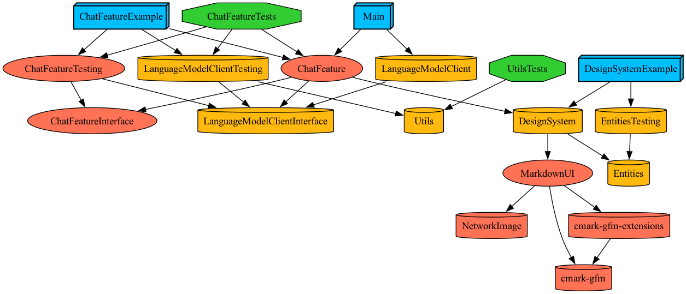

# LLM iOS App Example

## 🏗️ Architectures
- TMA(The Modular Architecture)
- Clean Architecture
- MVVM(Model-View-ViewModel)
- TCA(The Composable Architecture)

## 🛠️ Frameworks & Tools
- SwiftUI
- Combine
- Tuist
- Swift Testing
- Apple Foundation Models

## 🍰 Project Layers
- App
- Feature
- Core
- Foundation

## 📊 Dependency Graph

